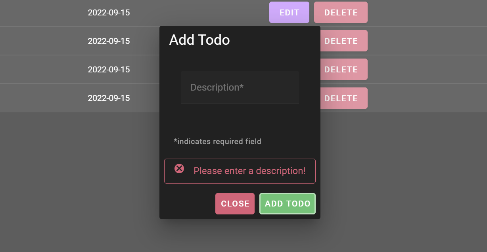

# TODO-APP

[Github Repository](https://github.com/biankazieba/modul_294)

## Environment variables

### `.env`

`VUE_APP_API_URL=XXX`

## Project setup

```
yarn install
```

### Make sure you use the OpenAPI-Backend from the Module 295 (Moodle-ZLI)

- I used Backend from the last ÜK, because this one was easier for me and i had it already (we bacame it from our last ÜK Coach)

Edit the .env file and change the `VUE_APP_API_URL` to the URL of the Backend

### Compiles and hot-reloads for development

```
yarn serve
```

### Compiles and minifies for production

```
yarn build
```

### Run your unit tests

```
yarn test:unit
```

### Lints and fixes files

```
yarn lint
```

### Customize configuration

See [Configuration Reference]().

## Manual test cases

- Without any login, you should see the Register and Login button

  

- Logged in, you should see the Log out button

  

- Pressing the "Bianka Zieba" button, the page should switch to my own Github

  

- You should see the todos as well

  

- Pressing the "Toggle dark mode" button, it should switch between dark/light mode

  

- By pressing the "delete" button, the todo should be deleted

  

- By pressing the "edit" button, a dialog should pop up and the todo can be successfully edited

  
  

- The same should be happening with the "add" button

  
  

- By entering a empty description, this error should pop up

  

